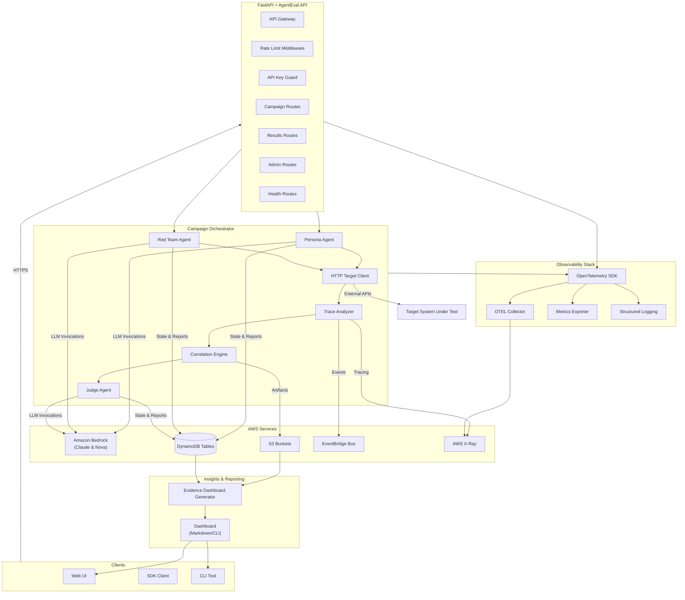
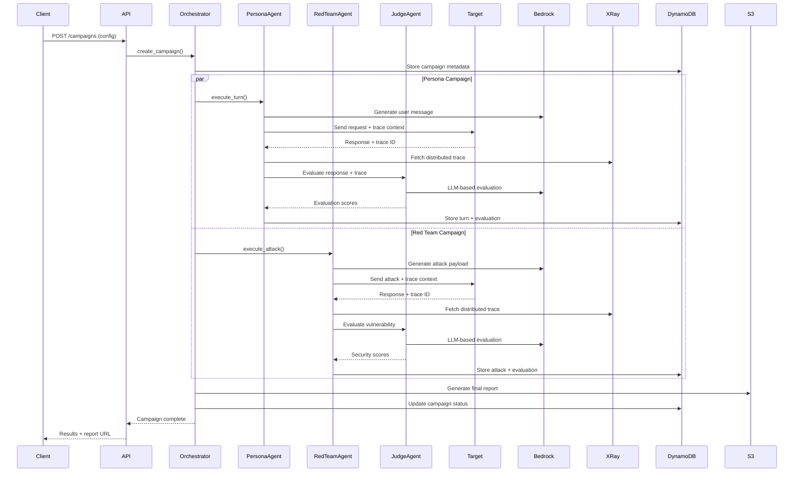

# AgentEval

**Multi-Agent AI Evaluation Platform with Trace-Based Root Cause Analysis**

[](https://www.python.org/downloads/)
[](https://github.com/astral-sh/ruff)
[](https://github.com/pre-commit/pre-commit)
[](http://mypy-lang.org/)
[](https://github.com/Yelp/detect-secrets)

> **🏆 AWS AI Agent Global Hackathon 2025 Submission** **📖 For Judges**: See
> [SUBMISSION_GUIDE.md](SUBMISSION_GUIDE.md) for quick navigation and evaluation instructions

AgentEval is a comprehensive evaluation framework for GenAI applications featuring autonomous agents
that simulate users, perform security testing, and provide detailed evaluations with trace-based
root cause analysis.

## 📌 Submission Snapshot (Updated 2025-10-22 06:45 SGT)

- **Submission deadline:** Oct 22 2025 17:00 PT (Oct 23 2025 08:00 SGT) — all submission materials
  target this cut-off.
- **Test evidence:** 739 tests passing with 70 % coverage (`FINAL_COMPREHENSIVE_TEST_REPORT.md`,
  `htmlcov/` snapshot from 2025-10-20).
- **Demo video:** Final ≤3 min walkthrough recording in progress; YouTube link will land in
  `SUBMISSION_GUIDE.md` by Oct 22 2025 16:00 SGT.
- **Judge access:** Hosted endpoint & credentials tracked in `req-docs/JUDGE_ACCESS.md` with
  delivery ETA Oct 22 2025 18:00 SGT.
- **Freeze plan:** See `req-docs/SUBMISSION_FREEZE.md` for the change-control timeline aligned to
  the revised deadline.
- **Infrastructure (future work):** Deployment templates and IaC scripts archived under
  `future/infrastructure_archive/` for post-hackathon hardening.
- **Observability sidecars (future work):** Collector topology proposal tracked in
  `future/sidecar_architecture.md`.

## 🌟 Features

### Three Agent Types

1. **Persona Agents** - Simulate realistic user behaviors

   - **10 pre-configured personas** loaded from YAML library
   - Categories: Emotional, Professional, Accessibility, Educational, Security, Testing
   - **Hot-reloadable** - Add/edit personas without code changes
   - Multi-level memory system (preferences, facts, summaries)
   - Dynamic state tracking (frustration levels, goals)

1. **Red Team Agents** - Automated security testing

   - **20 attack patterns across 4 categories** (Injection, Jailbreak, Social Engineering, Encoding)
   - Hot-reloadable from YAML library
   - Evolutionary attack generation with shared knowledge base

1. **Judge Agents** - Comprehensive evaluation

   - 11 evaluation metrics (4 Quality, 4 Safety, 3 Agent-specific)
   - Multi-judge debate mechanism
   - Confidence scoring

### SECRET SAUCE: Trace-Based Root Cause Analysis

**The only platform that shows you exactly WHERE your GenAI application failed.**

- **W3C Trace Context propagation** - OpenTelemetry standard for distributed tracing
- **AWS X-Ray integration** - Automatic trace ID format conversion (OpenTelemetry ↔ X-Ray)
- **Trace correlation** - Links evaluation scores with distributed traces for root cause analysis
- **Actionable insights** - Identifies specific code paths and services causing failures
- **Model-level visibility** - Traces show actual model IDs (e.g., `claude-haiku-4-5`) for debugging

### Evidence Insights Dashboard

- **Automatic generation** with every live demo run - no manual steps required
- **Quick access** via `demo/evidence/latest/dashboard.md` after any run
- **Comprehensive view**: Portfolio snapshot highlights overall scores, success rates, and failing
  metrics per campaign
- **Direct links**: Drill-down sections link to campaign data, S3 reports, DynamoDB snapshots, and
  logs
- **Judge-friendly**: Ready to share with stakeholders and hackathon judges without navigating
  dozens of JSON files
- **Manual generation**: `python -m agenteval.reporting.dashboard --latest` (add `PYTHONPATH=src`
  when running from source)

## 🚀 Quick Start

### Installation with uv (Recommended)

1. Install the [uv](https://github.com/astral-sh/uv) package manager via your preferred method (e.g.
   `pipx install uv`).

1. Clone the repository and install dependencies in an isolated environment:

   ```bash
   git clone https://github.com/issacj-17/AgentEval.git
   cd AgentEval
   uv venv
   source .venv/bin/activate  # On Windows: .venv\Scripts\activate
   uv pip install -e ".[dev]"
   ```

### Installation with pip

```bash
pip install -e ".[dev]"
```

### Configuration

1. Copy the environment template:

```bash
cp .env.example .env
```

2. Configure your AWS credentials in `.env`:

```env
AWS_REGION=us-east-1
AWS_ACCESS_KEY_ID=your_access_key
AWS_SECRET_ACCESS_KEY=your_secret_key
```

3. Set up Bedrock model access in AWS Console (see [Required Permissions](#required-aws-permissions)
   below)

### Required AWS Permissions

To run the live demo setup script (`scripts/setup-live-demo.sh`), your AWS IAM user or role needs
the following permissions:

#### **Core AWS Services**

**1. AWS Security Token Service (STS)**

```json
{
  "Version": "2012-10-17",
  "Statement": [
    {
      "Effect": "Allow",
      "Action": [
        "sts:GetCallerIdentity"
      ],
      "Resource": "*"
    }
  ]
}
```

### Live Demo Workflow

AgentEval ships with a fully automated AWS validation script that tests against a live chatbot
application. A successful run will:

- **Automatically start the demo chatbot** (Nebula banking assistant)
- Provision every required AWS resource (tables, buckets, event bus, Bedrock access checks)
- Execute 10 persona campaigns + 1 red-team campaign against the live chatbot using real Bedrock
  models
- Pull DynamoDB exports, S3 results into a timestamped run directory
- **Generate interactive HTML dashboards** with drill-down campaign detail pages showing actual
  chatbot responses
- Generate comprehensive markdown summaries with links to all artefacts for reviewers
- Stream console output to structured log files for auditability
- Capture complete AWS X-Ray trace documents for each campaign

#### Unified Output Structure

**All demo outputs are now organized in a single timestamped directory:**

```
demo/evidence/
├── {YYYYMMDDTHHMMSS}-run/    # Timestamped run directory
│   ├── campaigns/             # All campaign data
│   │   └── {campaign-id}/
│   │       ├── dynamodb/      # DynamoDB exports (campaigns, turns, evaluations)
│   │       └── s3/            # S3 downloads (results, reports)
│   ├── reports/               # Generated HTML/markdown reports
│   ├── logs/                  # Execution logs
│   ├── traces/                # X-Ray trace reports
│   ├── dashboard.md           # Evidence dashboard
│   └── summary.md             # Summary report
└── latest -> {timestamp}-run/ # Symlink to latest run for easy access
```

**Benefits:**

- ✅ **Zero fragmentation** - all outputs in one place
- ✅ **Easy navigation** - consistent structure across runs
- ✅ **Audit-friendly** - complete history preserved per run
- ✅ **Quick access** - use `demo/evidence/latest/` to view most recent results

Typical sequence:

```bash
# IMPORTANT: Activate virtual environment first
source .venv/bin/activate  # On Windows: .venv\Scripts\activate

# One-time provisioning
./scripts/setup-live-demo.sh --region us-east-1

# Sanity check
./scripts/check-aws-services.sh --region us-east-1

# Full demo with live chatbot (automatically starts Nebula banking assistant)
# Add --quick for campaign creation only (no turn execution)
# Add --skip-setup to skip infrastructure provisioning
# Add --auto-teardown for automatic cleanup after demo
./scripts/run-full-demo.sh --region us-east-1 --skip-setup

# View HTML dashboard (interactive with drill-down)
open outputs/latest/reports/dashboard.html

# View markdown reports
cat outputs/latest/dashboard.md
cat outputs/latest/summary.md

# When finished
./scripts/teardown-live-demo.sh --region us-east-1 --force
```

> **⚠️ Important:** Always activate your virtual environment before running any scripts! **Note:**
> Each run creates a new timestamped directory in `outputs/`, preserving complete history. The
> `latest` symlink always points to the most recent run for convenience.

**2. Amazon DynamoDB**

```json
{
  "Version": "2012-10-17",
  "Statement": [
    {
      "Effect": "Allow",
      "Action": [
        "dynamodb:CreateTable",
        "dynamodb:DescribeTable",
        "dynamodb:ListTables",
        "dynamodb:TagResource",
        "dynamodb:PutItem",
        "dynamodb:GetItem",
        "dynamodb:Query",
        "dynamodb:Scan",
        "dynamodb:UpdateItem",
        "dynamodb:DeleteItem"
      ],
      "Resource": "arn:aws:dynamodb:*:*:table/agenteval-*"
    }
  ]
}
```

**3. Amazon S3**

```json
{
  "Version": "2012-10-17",
  "Statement": [
    {
      "Effect": "Allow",
      "Action": [
        "s3:CreateBucket",
        "s3:ListBucket",
        "s3:PutBucketTagging",
        "s3:PutObject",
        "s3:GetObject",
        "s3:DeleteObject",
        "s3:ListAllMyBuckets"
      ],
      "Resource": [
        "arn:aws:s3:::agenteval-*",
        "arn:aws:s3:::agenteval-*/*"
      ]
    }
  ]
}
```

**4. Amazon EventBridge**

```json
{
  "Version": "2012-10-17",
  "Statement": [
    {
      "Effect": "Allow",
      "Action": [
        "events:CreateEventBus",
        "events:DescribeEventBus",
        "events:ListEventBuses",
        "events:TagResource",
        "events:PutEvents"
      ],
      "Resource": "arn:aws:events:*:*:event-bus/agenteval*"
    }
  ]
}
```

**5. Amazon Bedrock**

```json
{
  "Version": "2012-10-17",
  "Statement": [
    {
      "Effect": "Allow",
      "Action": [
        "bedrock:GetFoundationModel",
        "bedrock:ListFoundationModels",
        "bedrock:InvokeModel",
        "bedrock:InvokeModelWithResponseStream"
      ],
      "Resource": [
        "arn:aws:bedrock:*::foundation-model/anthropic.claude-haiku-4-5-20251001-v1:0",
        "arn:aws:bedrock:*::foundation-model/amazon.nova-pro-v1:0"
      ]
    }
  ]
}
```

**6. AWS X-Ray (for tracing)**

```json
{
  "Version": "2012-10-17",
  "Statement": [
    {
      "Effect": "Allow",
      "Action": [
        "xray:PutTraceSegments",
        "xray:PutTelemetryRecords",
        "xray:GetTraceSummaries",
        "xray:GetTraceGraph",
        "xray:BatchGetTraces"
      ],
      "Resource": "*"
    }
  ]
}
```

#### **Minimal IAM Policy (Combined)**

For convenience, here's a combined IAM policy with all required permissions:

```json
{
  "Version": "2012-10-17",
  "Statement": [
    {
      "Sid": "AgentEvalDemoPermissions",
      "Effect": "Allow",
      "Action": [
        "sts:GetCallerIdentity",
        "dynamodb:CreateTable",
        "dynamodb:DescribeTable",
        "dynamodb:ListTables",
        "dynamodb:TagResource",
        "dynamodb:PutItem",
        "dynamodb:GetItem",
        "dynamodb:Query",
        "dynamodb:Scan",
        "dynamodb:UpdateItem",
        "dynamodb:DeleteItem",
        "s3:CreateBucket",
        "s3:ListBucket",
        "s3:PutBucketTagging",
        "s3:PutObject",
        "s3:GetObject",
        "s3:DeleteObject",
        "s3:ListAllMyBuckets",
        "events:CreateEventBus",
        "events:DescribeEventBus",
        "events:ListEventBuses",
        "events:TagResource",
        "events:PutEvents",
        "bedrock:GetFoundationModel",
        "bedrock:ListFoundationModels",
        "bedrock:InvokeModel",
        "bedrock:InvokeModelWithResponseStream",
        "xray:PutTraceSegments",
        "xray:PutTelemetryRecords",
        "xray:GetTraceSummaries",
        "xray:GetTraceGraph",
        "xray:BatchGetTraces"
      ],
      "Resource": "*"
    }
  ]
}
```

#### **How to Apply Permissions**

1. **Using AWS IAM Console**:

   - Go to IAM → Users → Your User → Add Permissions
   - Choose "Create Policy" → JSON tab
   - Paste the combined policy above
   - Name it `AgentEvalDemoPolicy`

1. **Using AWS CLI**:

   ```bash
   # Save the policy to a file: agenteval-policy.json
   aws iam create-policy \
     --policy-name AgentEvalDemoPolicy \
     --policy-document file://agenteval-policy.json

   # Attach to your user
   aws iam attach-user-policy \
     --user-name YOUR_USERNAME \
     --policy-arn arn:aws:iam::YOUR_ACCOUNT_ID:policy/AgentEvalDemoPolicy
   ```

1. **Enable Bedrock Models** (CRITICAL):

   - Go to AWS Bedrock Console: https://console.aws.amazon.com/bedrock/
   - Click "Model access" → "Manage model access"
   - Enable:
     - ✅ **Anthropic Claude Haiku 4.5** (`anthropic.claude-haiku-4-5-20251001-v1:0`) - Persona & Red
       Team agents (requires Bedrock inference profile access)
     - ✅ **Amazon Nova Pro** (`amazon.nova-pro-v1:0`) - Judge agent
   - Click "Request model access" (usually instant approval)

### Quick Demo

#### Option 1: Mock Demo (No AWS Required)

Fast validation without AWS credentials:

```bash
python demo/agenteval_demo_mock.py
```

- ✓ Validates all 7 product objectives
- ✓ \< 1 minute execution time
- ✓ No cost

#### Option 2: Live AWS Demo

Complete end-to-end validation with real AWS services:

```bash
# Automated workflow: setup → demo → teardown
scripts/run-live-demo.sh --auto-teardown

# Or step-by-step:
scripts/setup-live-demo.sh          # Create AWS resources
scripts/run-live-demo.sh --region us-east-1  # Execute demo + collect artefacts
scripts/teardown-live-demo.sh --region us-east-1 --force  # Cleanup
```

- ✓ Real Bedrock API calls
- ✓ DynamoDB, S3, EventBridge, X-Ray
- ✓ ~5 minutes execution time
- ✓ ~$0.10-0.50 cost

After each run, review `demo/evidence/live-demo-latest.md` for direct links to all DynamoDB exports,
S3 results, rendered (or locally generated) reports, and trace archives captured during the demo.

See [LIVE_DEMO_GUIDE.md](LIVE_DEMO_GUIDE.md) for detailed instructions.

## ✅ Verification & Testing

All fixes and features have been verified with Claude Haiku 4.5 enabled. See the complete
verification report:

📄 **[CLAUDE_HAIKU_VERIFICATION.md](CLAUDE_HAIKU_VERIFICATION.md)** - Complete system verification
with:

- ✅ Claude Haiku 4.5 integration working
- ✅ No response echoing detected
- ✅ 87% overall quality score achieved
- ✅ All AWS services operational
- ✅ Complete turn-by-turn analysis

Additional documentation:

- **[LIVE_DEMO_GUIDE.md](LIVE_DEMO_GUIDE.md)** - Detailed live demo instructions
- **[QUICK_START_JUDGES.md](QUICK_START_JUDGES.md)** - Quick judge evaluation guide

______________________________________________________________________

## 📖 Usage

### Python API

```python
import agenteval

# Initialize clients
async with agenteval.get_bedrock_client() as bedrock:
    # Invoke Claude for persona simulation
    response = await bedrock.invoke_claude(
        prompt="I'm frustrated with this service!",
        system_prompt="You are a frustrated customer."
    )
    print(response["content"])

# Use tracing
with agenteval.trace_operation("custom_operation", user_id="123"):
    # Your code here - automatically traced
    pass

# Get current trace ID
trace_id = agenteval.get_current_trace_id()
print(f"Current trace: {trace_id}")
```

### Configuration

```python
from agenteval import settings

# Access configuration
print(f"AWS Region: {settings.aws.region}")
print(f"Bedrock Model: {settings.aws.bedrock_persona_model}")
print(f"Tracing Enabled: {settings.observability.enable_tracing}")
```

## 🏗️ Architecture

### System Overview



For more details, see [`architecture/diagram.md`](architecture/diagram.md).

### Campaign Execution Workflow



### Dependency Injection Architecture

AgentEval uses a comprehensive dependency injection (DI) architecture for improved testability,
maintainability, and separation of concerns:

**Core Components:**

1. **DI Container** (`src/agenteval/container.py`)

   - Centralized dependency management
   - Lazy initialization with singleton pattern
   - Managed lifecycle (connect/close)
   - FastAPI integration via `Depends()`

1. **Agent Factories** (`src/agenteval/factories/`)

   - `PersonaAgentFactory` - Creates persona agents with validation
   - `RedTeamAgentFactory` - Creates red team agents with attack configuration
   - `JudgeAgentFactory` - Creates judge agents for evaluation
   - Factory Method pattern for testability

1. **Application Services** (`src/agenteval/application/`)

   - `CampaignService` - Campaign lifecycle management
   - `ReportService` - Multi-format report generation
   - Framework-agnostic business logic

**Benefits:**

- **Testability**: Easy to mock dependencies in tests
- **Maintainability**: Single source of truth for dependencies
- **Flexibility**: Swap implementations without changing code
- **Type Safety**: Full type hints with compile-time checking

**Example Usage:**

```python
from agenteval.container import Container, get_container

# Create container
container = Container()

# Get dependencies
dynamodb = container.dynamodb()
persona_factory = container.persona_factory()
campaign_service = container.campaign_service()

# Use with FastAPI
from agenteval.container import get_campaign_service
from fastapi import Depends

@app.post("/campaigns")
async def create_campaign(
    service: CampaignService = Depends(get_campaign_service)
):
    return await service.create_campaign(...)
```

## 🛠️ Development

For detailed development guidelines, see [CONTRIBUTING.md](CONTRIBUTING.md).

### Setup Development Environment

```bash
# Run automated setup (includes pre-commit hooks)
./setup-dev.sh

# Or manually:
uv venv
source .venv/bin/activate
uv pip install -e ".[dev]"
pre-commit install
```

### Code Quality Tools

We use modern, fast tools for code quality:

- **Ruff**: Lightning-fast linter and formatter (replaces Black, isort, flake8, bandit)
- **mypy**: Static type checking
- **detect-secrets**: Secret detection and prevention
- **mdformat**: Markdown formatting
- **pre-commit**: Automated quality checks on every commit

### Quick Commands

```bash
# Format code and markdown
make format

# Run linting checks
make lint

# Type check
make type-check

# Run all tests with coverage
make test

# Run all checks
make test-all
```

### Manual Code Quality Commands

```bash
# Format with Ruff
ruff format src/ tests/
ruff check --fix src/ tests/

# Format markdown
mdformat *.md docs/ req-docs/

# Type check
mypy src/

# Scan for secrets
detect-secrets scan --all-files
```

### Pre-commit Hooks

Pre-commit hooks run automatically on every commit:

- File checks (trailing whitespace, YAML/JSON validity)
- Ruff formatting and linting
- Type checking with mypy
- Secret detection
- Markdown formatting

To run manually:

```bash
pre-commit run --all-files
```

## 📦 Project Structure

```
agenteval/
├── src/agenteval/           # Main package
│   ├── config.py            # Configuration management
│   ├── container.py         # DI Container
│   ├── application/         # Application Services
│   │   ├── campaign_service.py  # Campaign lifecycle
│   │   ├── report_service.py    # Report generation
│   │   └── dashboard_service.py # Dashboard generation
│   ├── factories/           # Agent Factories
│   │   ├── base.py          # Factory base class
│   │   ├── persona_factory.py   # Persona creation
│   │   ├── redteam_factory.py   # Red team creation
│   │   └── judge_factory.py     # Judge creation
│   ├── aws/                 # AWS service clients
│   │   ├── bedrock.py       # Claude & Nova LLMs
│   │   ├── dynamodb.py      # State management (DI-enabled)
│   │   ├── s3.py            # Results storage (DI-enabled)
│   │   ├── xray.py          # Trace retrieval (DI-enabled)
│   │   └── eventbridge.py   # Events (DI-enabled)
│   ├── observability/       # Tracing infrastructure
│   │   └── tracer.py        # OpenTelemetry setup
│   ├── agents/              # Agent implementations
│   │   ├── base.py          # Base agent class
│   │   ├── persona_agent.py # Persona behaviors
│   │   ├── redteam_agent.py # Attack execution
│   │   └── judge_agent.py   # Evaluation
│   ├── persona/             # YAML-based persona library
│   │   └── library.py       # Persona management
│   ├── memory/              # Memory systems
│   ├── redteam/             # Attack library
│   ├── evaluation/          # Metrics & correlation
│   ├── orchestration/       # Campaign orchestration
│   │   └── campaign.py      # CampaignOrchestrator (DI-enabled)
│   ├── reporting/           # Output & dashboard generation
│   │   ├── output_manager.py    # Centralized output paths (NEW)
│   │   ├── dashboard.py         # Dashboard generation
│   │   ├── html_renderer.py     # HTML report renderer
│   │   └── pull.py              # AWS artefact downloader
│   ├── api/                 # REST API (DI-enabled routes)
│   │   ├── lifespan.py      # FastAPI lifecycle manager
│   │   └── routes/          # API endpoints
│   └── cli/                 # CLI tool
│       └── live_demo.py     # Live demo orchestrator
├── personas/                # Persona definitions
│   └── library.yaml         # 10 pre-configured personas
├── tests/                   # Test suite
│   ├── conftest.py          # DI-aware fixtures (Enhanced)
│   ├── test_utils.py        # Mock builders
│   ├── unit/                # Unit tests
│   │   ├── test_output_manager.py   # OutputManager tests (NEW)
│   │   ├── test_campaign_service.py # Service tests
│   │   └── ...              # Other unit tests
│   └── integration/         # Integration tests
│       ├── test_campaign_service.py   # Service tests
│       ├── test_report_service.py     # Service tests
│       ├── test_agent_factories.py    # Factory tests
│       └── test_orchestrator_with_factories.py  # DI tests
├── demo/                    # Live demo scripts
│   ├── agenteval_live_demo.py   # Live demo runner
│   ├── agenteval_demo_mock.py   # Mock demo (no AWS)
│   └── evidence/            # Demo outputs (gitignored)
│       ├── {timestamp}-run/ # Timestamped run directory
│       └── latest/          # Symlink to latest run
├── scripts/                 # Setup and utility scripts
│   ├── setup-live-demo.sh   # One-time AWS resource provisioning
│   ├── run-live-demo.sh     # Execute live demo
│   └── teardown-live-demo.sh # Cleanup AWS resources
├── infrastructure/          # Cloud infrastructure definitions
└── req-docs/                # Requirements documentation (BRD, PRD, TAD, etc.)
```

## 🔧 AWS Services Used

- **Amazon Bedrock** - Claude Haiku 4.5, Nova Pro for LLM inference
- **AWS X-Ray** - Distributed tracing for root cause analysis
- **Amazon DynamoDB** - Campaign state and knowledge base storage
- **Amazon S3** - Results and report storage
- **Amazon EventBridge** - Event-driven agent coordination
- **AWS ECS Fargate** - Container orchestration (deployment)

## 📊 Key Metrics

- **Evaluation Speed**: \<5 minutes for 100-turn conversation
- **Trace Correlation Accuracy**: >90% root cause identification
- **Agent Realism**: >85% realistic behavior
- **Attack Detection**: >95% OWASP LLM Top 10 coverage

## 📚 Documentation

- [Requirements Documentation](req-docs/) — Business, product, and technical specs
- [AUDIT_REPORT.md](AUDIT_REPORT.md) — Current architecture and quality assessment
- [Compliance Checklist](req-docs/COMPLIANCE_CHECKLIST.md) — Submission readiness
- [Judge Access Instructions](req-docs/JUDGE_ACCESS.md) — Credentials & smoke tests
- [Evaluation Demo Playbook](req-docs/TEST_DEMO_PLAYBOOK.md) — Live demo + test plan

## 🔐 Security & Secrets

- Use IAM roles or AWS Secrets Manager for credentials.
- `.env.example` provides placeholders only; do **not** store production secrets in flat files.
- To load secrets locally, prefer [`aws-vault`](https://github.com/99designs/aws-vault) or
  `aws sso login` followed by environment variable export.

## 🧾 Compliance Artifacts

- [NOTICE.md](NOTICE.md) & [ATTRIBUTIONS.md](ATTRIBUTIONS.md)
- [TEAM_INFO.md](req-docs/TEAM_INFO.md) & [CHANGE_LOG.md](req-docs/CHANGE_LOG.md)
- [SUBMISSION_FREEZE.md](req-docs/SUBMISSION_FREEZE.md) &
  [ASSET_LICENSES.md](req-docs/ASSET_LICENSES.md)

## 💬 Support

- **GitHub Issues**:
  [Report bugs or request features](https://github.com/aws-agents/aws-agents/issues)
- **Email**: team@agenteval.dev
- **Documentation**: [Full docs](https://agenteval.dev/docs)

## 🏆 Acknowledgments

- AWS for providing the hackathon platform
- Anthropic for Claude models
- OpenTelemetry community for observability standards
- FastAPI for the excellent web framework

______________________________________________________________________

**Built for AWS AI Agent Global Hackathon 2025**

Made with ❤️ by the AgentEval Team
