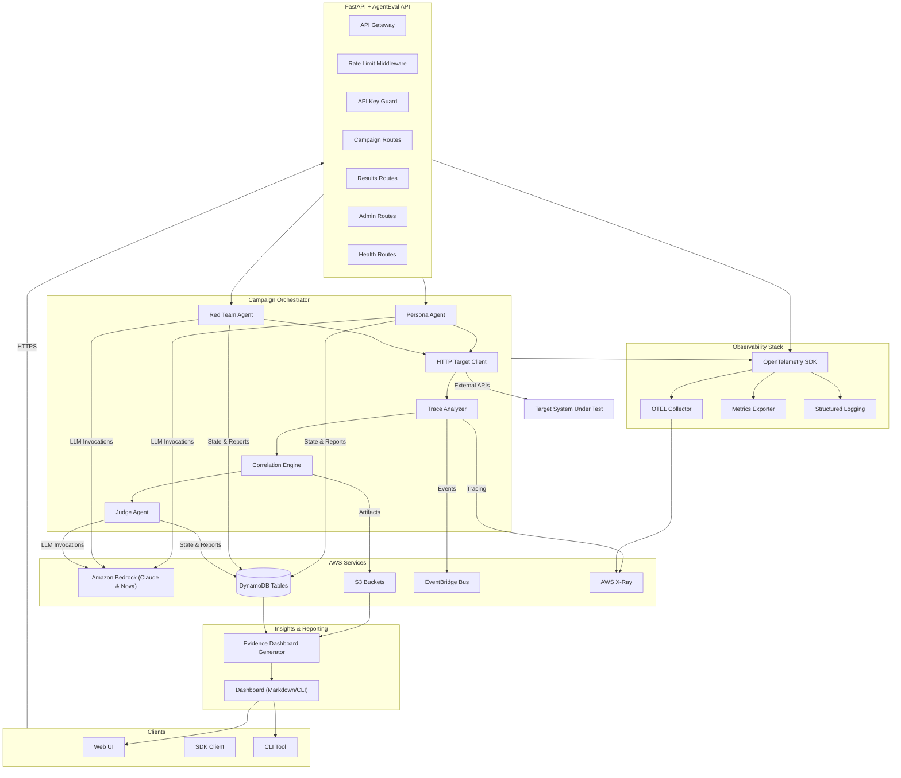

```mermaid
flowchart TD
    subgraph Clients
        WebUI[Web UI]
        SDKClient[SDK Client]
        CLITool[CLI Tool]
    end

    subgraph API["FastAPI + AgentEval API"]
        Gateway[API Gateway]
        RateLimiter[Rate Limit Middleware]
        AuthDeps[API Key Guard]
        CampaignRoutes[Campaign Routes]
        ResultsRoutes[Results Routes]
        AdminRoutes[Admin Routes]
        HealthRoutes[Health Routes]
    end

    subgraph Orchestration["Campaign Orchestrator"]
        PersonaAgent[Persona Agent]
        RedTeamAgent[Red Team Agent]
        JudgeAgent[Judge Agent]
        TraceAnalyzer[Trace Analyzer]
        CorrelationEngine[Correlation Engine]
        HttpClient[HTTP Target Client]
    end

    subgraph AWS["AWS Services"]
        Bedrock["Amazon Bedrock (Claude & Nova)"]
        DynamoDB[(DynamoDB Tables)]
        S3[S3 Buckets]
        EventBridge[EventBridge Bus]
        XRay[AWS X-Ray]
    end

    Clients -->|HTTPS| API
    API --> PersonaAgent
    API --> RedTeamAgent

    PersonaAgent --> HttpClient
    RedTeamAgent --> HttpClient
    PersonaAgent -->|LLM Invocations| Bedrock
    RedTeamAgent -->|LLM Invocations| Bedrock
    JudgeAgent -->|LLM Invocations| Bedrock

    HttpClient -->|External APIs| TargetSystem[Target System Under Test]
    HttpClient --> TraceAnalyzer
    TraceAnalyzer --> CorrelationEngine
    CorrelationEngine --> JudgeAgent

    PersonaAgent -->|State & Reports| DynamoDB
    RedTeamAgent -->|State & Reports| DynamoDB
    JudgeAgent -->|State & Reports| DynamoDB
    CorrelationEngine -->|Artifacts| S3
    TraceAnalyzer -->|Events| EventBridge
    TraceAnalyzer -->|Tracing| XRay

    subgraph Observability["Observability Stack"]
        OTEL[OpenTelemetry SDK]
        Collector[OTEL Collector]
        MetricsProm[Metrics Exporter]
        Logs[Structured Logging]
    end

    API --> OTEL
    Orchestration --> OTEL
    OTEL --> Collector --> XRay
    OTEL --> MetricsProm
    OTEL --> Logs

    subgraph Insights["Insights & Reporting"]
        EvidenceDashboard[Evidence Dashboard Generator]
        DashboardOutput["Dashboard (Markdown/CLI)"]
    end

    S3 --> EvidenceDashboard
    DynamoDB --> EvidenceDashboard
    EvidenceDashboard --> DashboardOutput
    DashboardOutput --> CLITool
    DashboardOutput --> WebUI
```
