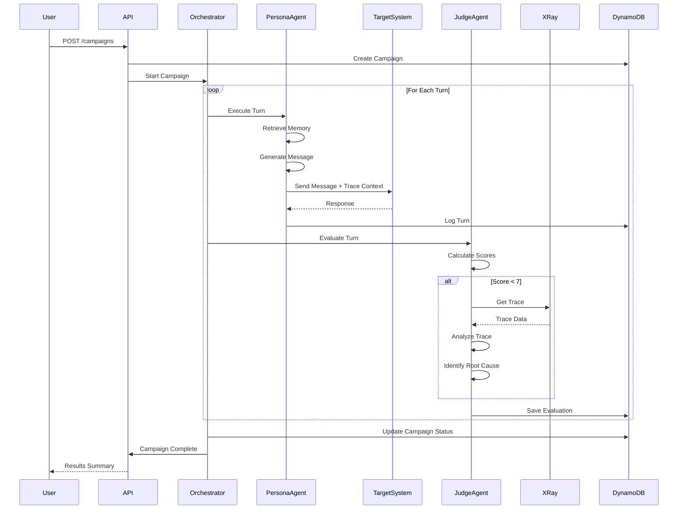
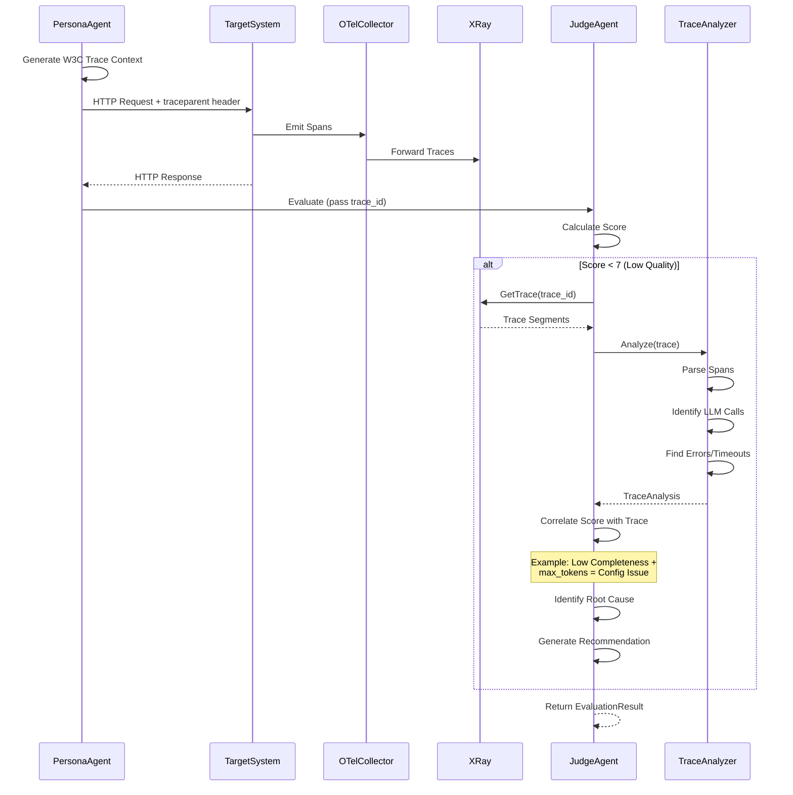
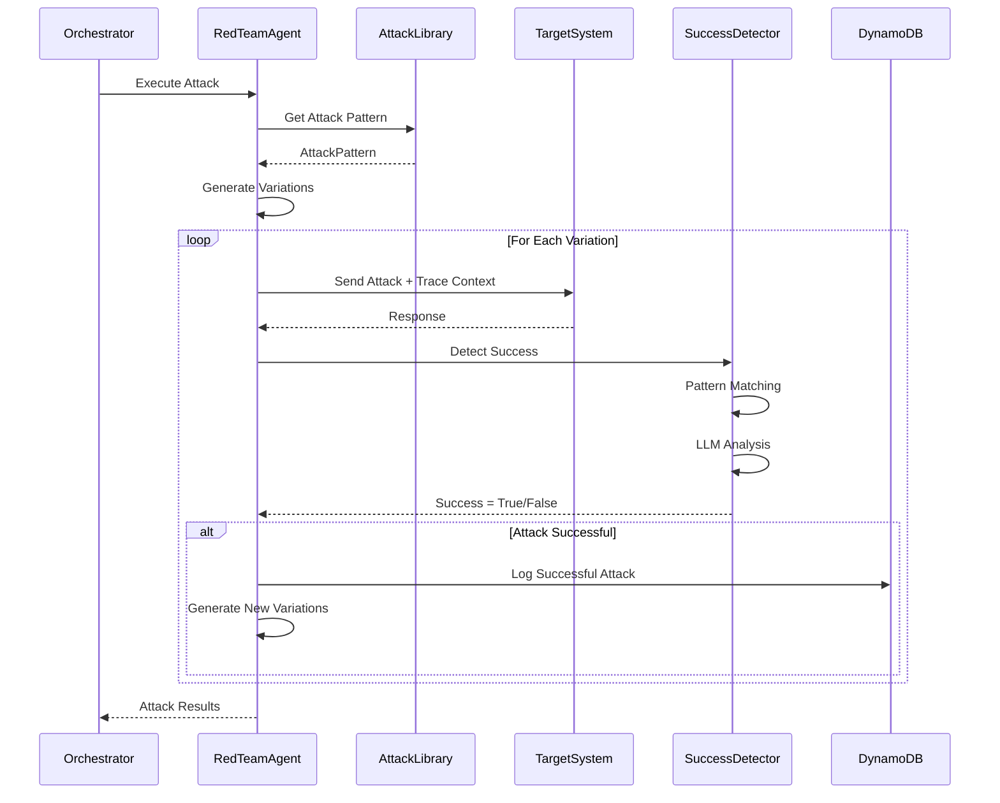
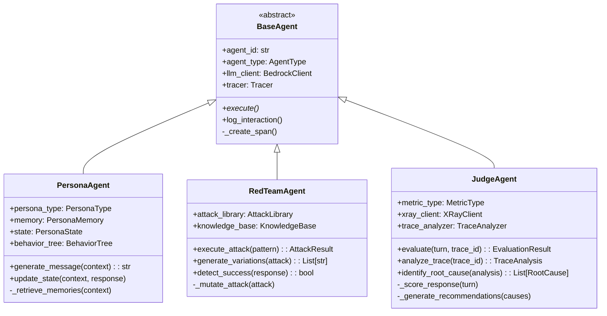
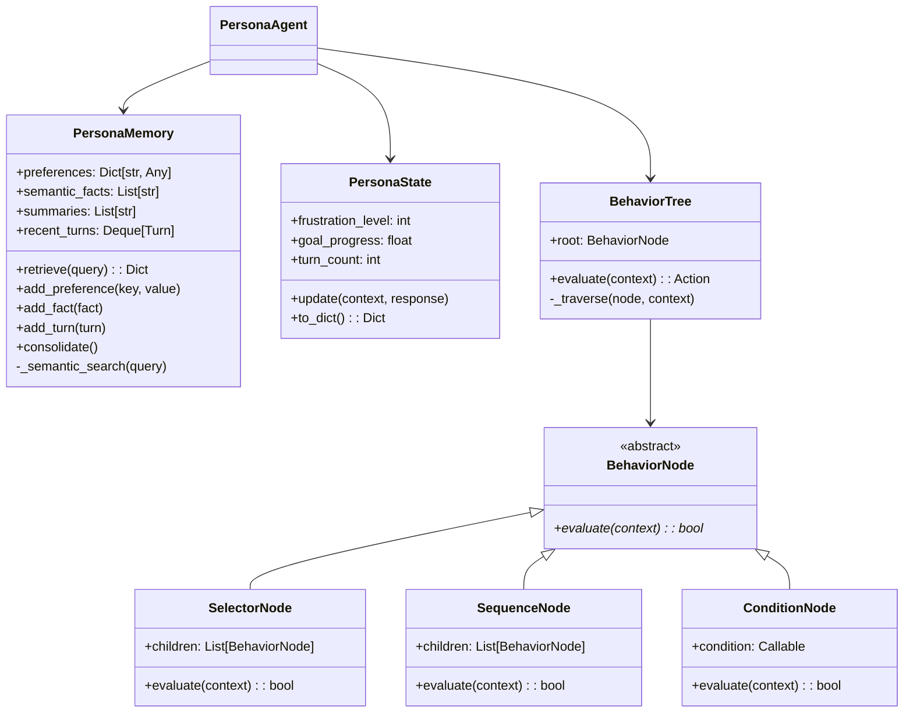
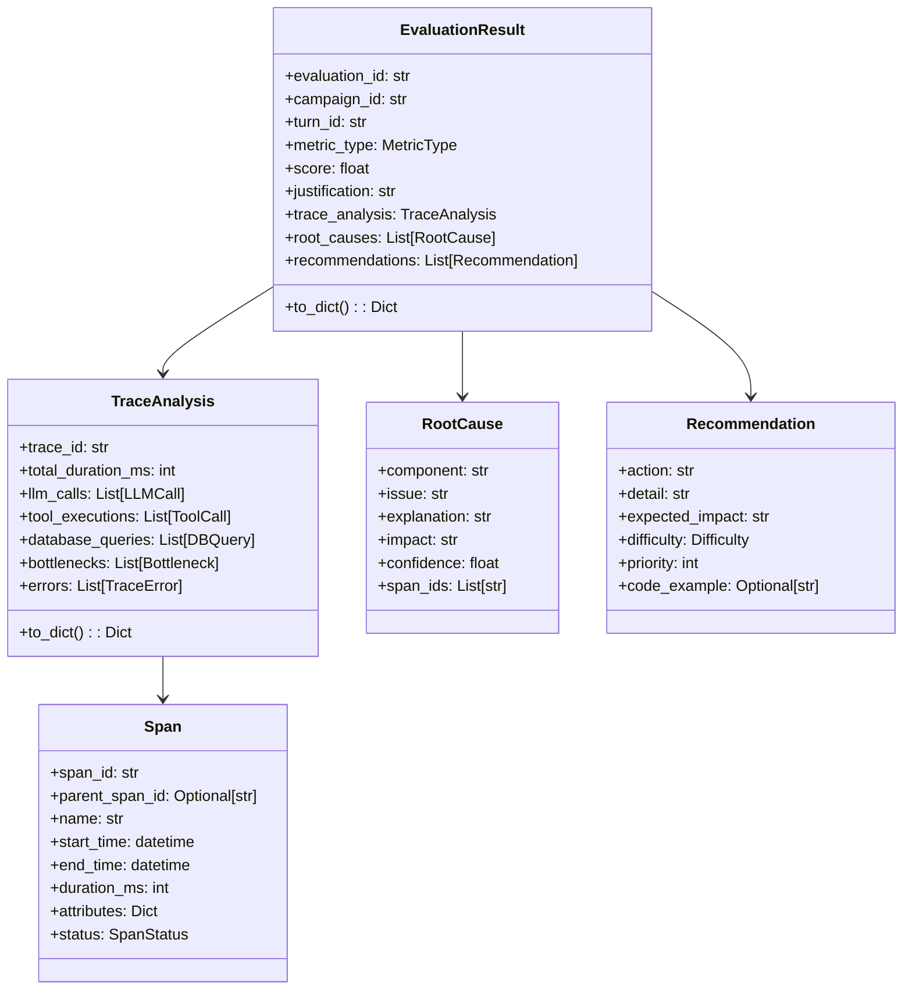
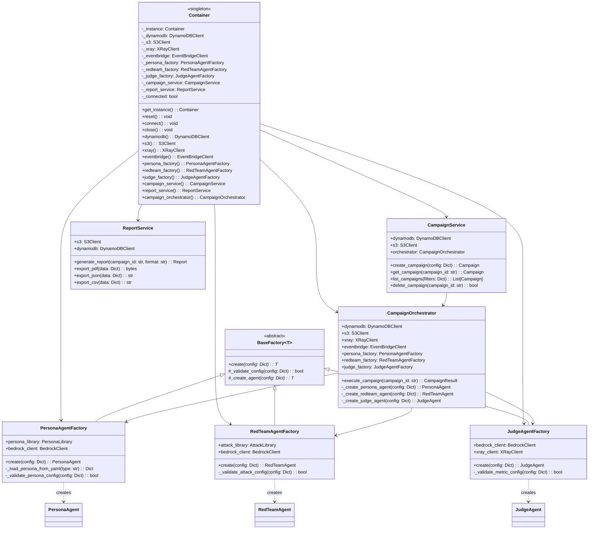

# Technical Architecture Document (TAD)

## AgentEval: System Design & Architecture

**Document Version:** 1.1 **Date:** October 12, 2025 **Status:** Approved for Implementation - DI
Refactoring Complete **Chief Architect:** \[Your Name\] **Technical Lead:** \[Name\]

______________________________________________________________________

## TABLE OF CONTENTS

1. [Architecture Overview](#1-architecture-overview)
1. [System Context](#2-system-context)
1. [Component Architecture](#3-component-architecture)
1. [Use Case Diagrams](#4-use-case-diagrams)
1. [Sequence Diagrams](#5-sequence-diagrams)
1. [Class Diagrams](#6-class-diagrams)
1. [Data Architecture](#7-data-architecture)
1. [Deployment Architecture](#8-deployment-architecture)
1. [Security Architecture](#9-security-architecture)
1. [Technology Stack](#10-technology-stack)

______________________________________________________________________

## 1. ARCHITECTURE OVERVIEW

### 1.1 Architectural Style

**Style:** Microservices-inspired, Event-Driven, Serverless-Ready

**Key Characteristics:**

- **Modular:** Loosely coupled components with clear boundaries
- **Async-First:** Non-blocking I/O for scalability
- **Event-Driven:** Components communicate via events (EventBridge)
- **Observable:** OpenTelemetry instrumentation throughout
- **Cloud-Native:** AWS-native services for reliability and scale

### 1.2 Architectural Principles

**1. Separation of Concerns**

- Agents (Persona, Red Team, Judge) are independent
- Orchestrator coordinates but doesn't implement agent logic
- State management separated from business logic

**2. Single Responsibility**

- Each component has one clear purpose
- Agent types don't overlap in functionality
- Clear interfaces between layers

**3. DRY (Don't Repeat Yourself)**

- Base agent class provides common functionality
- Shared utilities for tracing, AWS clients, etc.
- Reusable evaluation metrics

**4. SOLID Principles**

- **S:** Single Responsibility (see above)
- **O:** Open/Closed (extensible via inheritance and factories)
- **L:** Liskov Substitution (agents interchangeable)
- **I:** Interface Segregation (minimal interfaces)
- **D:** Dependency Inversion (DI Container with constructor injection)

**5. Fail Fast**

- Validate inputs early
- Explicit error handling
- No silent failures

**6. Idempotency**

- API operations can be retried safely
- Campaign resume works from any point
- No duplicate processing

______________________________________________________________________

## 2. SYSTEM CONTEXT

### 2.1 System Context Diagram

```
┌────────────────────────────────────────────────────────────┐
│                     External Systems                        │
│                                                             │
│  ┌──────────────┐  ┌──────────────┐  ┌──────────────┐    │
│  │              │  │              │  │              │    │
│  │   AI         │  │   Product    │  │  Security    │    │
│  │   Engineer   │  │   Manager    │  │  Engineer    │    │
│  │              │  │              │  │              │    │
│  └──────┬───────┘  └──────┬───────┘  └──────┬───────┘    │
│         │                 │                 │             │
│         └─────────────────┼─────────────────┘             │
│                           │                               │
│                           ▼                               │
│         ┌─────────────────────────────────┐              │
│         │                                  │              │
│         │        AgentEval Platform        │              │
│         │                                  │              │
│         │  • Campaign Management           │              │
│         │  • Multi-Agent Evaluation        │              │
│         │  • Trace Correlation             │              │
│         │  • Root Cause Analysis           │              │
│         │                                  │              │
│         └─────────────┬───────────────────┘              │
│                       │                                   │
│                       ▼                                   │
│         ┌─────────────────────────────────┐              │
│         │                                  │              │
│         │   Target GenAI Application       │              │
│         │   (Customer System)              │              │
│         │                                  │              │
│         └─────────────────────────────────┘              │
│                                                           │
│  ┌──────────────────────────────────────────────────┐   │
│  │            AWS Services                           │   │
│  │                                                    │   │
│  │  • Amazon Bedrock (Claude, Nova)                  │   │
│  │  • AWS X-Ray (Distributed Tracing)                │   │
│  │  • DynamoDB (State Management)                    │   │
│  │  • S3 (Results Storage)                           │   │
│  │  • EventBridge (Event Bus)                        │   │
│  │  • ECS Fargate (Compute)                          │   │
│  │  • CloudFormation (Infrastructure)                │   │
│  │                                                    │   │
│  └──────────────────────────────────────────────────┘   │
│                                                           │
└────────────────────────────────────────────────────────────┘
```

### 2.2 Key Interfaces

**User Interfaces:**

- RESTful API (primary)
- Python SDK (secondary)
- CLI Tool (tertiary)
- Web Dashboard (future)

**External System Interfaces:**

- Target GenAI Application (HTTP/HTTPS)
- AWS Services (AWS SDK - boto3)
- OpenTelemetry Collector (gRPC)

**Data Interfaces:**

- DynamoDB (AWS SDK)
- S3 (AWS SDK)
- X-Ray (AWS SDK)

______________________________________________________________________

## 3. COMPONENT ARCHITECTURE

### 3.1 High-Level Component Diagram

```
┌─────────────────────────────────────────────────────────────┐
│                      API Layer                               │
│  ┌──────────────────────────────────────────────────────┐  │
│  │  FastAPI Application + OpenTelemetry Auto-Instrument  │  │
│  └──────────────────────────────────────────────────────┘  │
└────────────────────────┬────────────────────────────────────┘
                         │
                         ▼
┌─────────────────────────────────────────────────────────────┐
│                   Orchestration Layer                        │
│  ┌──────────────────────┐  ┌──────────────────────┐        │
│  │  Campaign            │  │  State Manager       │        │
│  │  Orchestrator        │◄─┤  (DynamoDB Client)   │        │
│  └──────────────────────┘  └──────────────────────┘        │
│            │                                                 │
│            ▼                                                 │
│  ┌──────────────────────┐                                   │
│  │  Event Dispatcher    │                                   │
│  │  (EventBridge)       │                                   │
│  └──────────────────────┘                                   │
└────────────────────────┬────────────────────────────────────┘
                         │
          ┌──────────────┼──────────────┐
          │              │              │
          ▼              ▼              ▼
┌─────────────┐  ┌─────────────┐  ┌─────────────┐
│  Persona    │  │  Red Team   │  │  Judge      │
│  Agents     │  │  Agents     │  │  Agents     │
│             │  │             │  │             │
│ • Memory    │  │ • Attacks   │  │ • Metrics   │
│ • Behavior  │  │ • Mutations │  │ • Traces    │
│ • State     │  │ • Detection │  │ • Analysis  │
└─────────────┘  └─────────────┘  └─────────────┘
          │              │              │
          └──────────────┼──────────────┘
                         │
                         ▼
          ┌──────────────────────────┐
          │  Target System Proxy     │
          │  (HTTP Client + Tracing) │
          └──────────────────────────┘
                         │
                         ▼
          ┌──────────────────────────┐
          │  Target GenAI System     │
          │  (Customer Application)  │
          └──────────────────────────┘
                         │
                         ▼
┌─────────────────────────────────────────────────────────────┐
│                   Observability Layer                        │
│  ┌──────────────────┐    ┌──────────────────┐              │
│  │  OTel Collector  │───▶│   AWS X-Ray      │              │
│  │  (ADOT)          │    │   (Traces)       │              │
│  └──────────────────┘    └──────────────────┘              │
│                                    │                         │
│                                    ▼                         │
│  ┌──────────────────────────────────────────────────────┐  │
│  │           Trace Analyzer                              │  │
│  │  • Parse X-Ray traces                                 │  │
│  │  • Identify LLM calls, tools, DB queries              │  │
│  │  • Build failure chains                               │  │
│  │  • Generate root cause explanations                   │  │
│  └──────────────────────────────────────────────────────┘  │
└─────────────────────────────────────────────────────────────┘
                         │
                         ▼
┌─────────────────────────────────────────────────────────────┐
│                      Results Layer                           │
│  ┌──────────────────┐    ┌──────────────────┐              │
│  │  Results Storage │    │  Report Generator │              │
│  │  (S3)            │    │  (PDF/JSON/CSV)   │              │
│  └──────────────────┘    └──────────────────┘              │
└─────────────────────────────────────────────────────────────┘
```

### 3.2 Component Descriptions

#### API Layer

**Responsibilities:**

- Expose RESTful endpoints for campaign management
- Handle authentication and authorization
- Validate requests and sanitize inputs
- Return structured responses

**Technologies:**

- FastAPI (async web framework)
- Pydantic (data validation)
- OpenTelemetry (auto-instrumentation)

#### Orchestration Layer

**Components:**

**DI Container:**

- Centralized dependency management
- Singleton pattern with lazy initialization
- Lifecycle management (connect/close)
- Thread-safe with reset functionality
- FastAPI integration via `Depends()`

**Agent Factories:**

- Factory Method pattern for agent creation
- PersonaAgentFactory: Creates persona agents with YAML validation
- RedTeamAgentFactory: Creates red team agents with attack config
- JudgeAgentFactory: Creates judge agents with metric selection
- Improved testability with dependency injection

**Application Services:**

- CampaignService: Campaign lifecycle management
- ReportService: Multi-format report generation (PDF/JSON/CSV)
- Framework-agnostic business logic

**Campaign Orchestrator:**

- Coordinates agent execution via injected factories
- Manages campaign lifecycle
- Implements evaluation workflow
- Uses constructor injection for dependencies

**State Manager:**

- Persists campaign state to DynamoDB
- Handles state transitions
- Provides state recovery for pause/resume

**Event Dispatcher:**

- Publishes events to EventBridge
- Enables async processing and notifications

#### Agent Layer

**Components:**

**Persona Agents:**

- Simulate user behaviors
- Maintain multi-level memory
- Track dynamic state (frustration, goals)
- Generate contextually appropriate messages

**Red Team Agents:**

- Execute attack patterns
- Generate attack variations
- Detect attack success
- Share knowledge via DynamoDB

**Judge Agents:**

- Evaluate responses across metrics
- Fetch and analyze traces
- Identify root causes
- Generate actionable recommendations

#### Target System Proxy

**Responsibilities:**

- Send messages to target system
- Propagate W3C Trace Context
- Handle HTTP communication
- Manage retries and timeouts

#### Observability Layer

**Components:**

**OTel Collector:**

- Receive traces from application
- Forward to AWS X-Ray
- Buffer and batch for efficiency

**Trace Analyzer:**

- Parse X-Ray trace format
- Identify span types
- Extract metrics (duration, tokens, errors)
- Build trace trees

#### Results Layer

**Components:**

**Results Storage:**

- Persist evaluation results to S3
- Enable long-term archival
- Support exports in multiple formats

**Report Generator:**

- Create evaluation reports
- Format as PDF, JSON, CSV
- Include trace visualizations

#### Insights Layer

**Components:**

**Evidence Dashboard Generator:**

- CLI/automation entrypoint (`python -m agenteval.reporting.dashboard`)
- Scans latest `demo/evidence/pulled-reports/<timestamp>` export
- Aggregates DynamoDB snapshots + S3 reports into Markdown summary
- Produces portfolio-level KPIs and per-campaign drill-down sections
- Links raw artefacts for auditors/judges

**Future Presentation Layer (Optional):**

- React/Streamlit front-end reading generated JSON/Markdown
- Live refresh hook post `scripts/run-live-demo.sh`
- Supports judge-friendly filters and comparisons

______________________________________________________________________

## 4. USE CASE DIAGRAMS

### 4.1 Primary Use Cases

```
┌────────────────────────────────────────────────────────┐
│                  AgentEval System                      │
│                                                        │
│  ┌──────────────────────────────────────────────┐    │
│  │                                               │    │
│  │  UC-1: Create Evaluation Campaign            │    │
│  │    ◄─────────────── AI Engineer              │    │
│  │                                               │    │
│  │  UC-2: Configure Campaign Settings           │    │
│  │    ◄─────────────── AI Engineer              │    │
│  │                                               │    │
│  │  UC-3: Execute Persona Simulation            │    │
│  │    ◄──────────┬──── System (automated)       │    │
│  │               │                               │    │
│  │  UC-4: Execute Red Team Testing              │    │
│  │    ◄──────────┤                               │    │
│  │               │                               │    │
│  │  UC-5: Evaluate Target System                │    │
│  │    ◄──────────┘                               │    │
│  │                                               │    │
│  │  UC-6: Analyze Traces                        │    │
│  │    ◄─────────────── System (automated)       │    │
│  │                                               │    │
│  │  UC-7: Identify Root Causes                  │    │
│  │    ◄─────────────── System (automated)       │    │
│  │                                               │    │
│  │  UC-8: View Evaluation Results               │    │
│  │    ◄─────────────── AI Engineer              │    │
│  │    ◄─────────────── Product Manager          │    │
│  │                                               │    │
│  │  UC-9: Export Reports                        │    │
│  │    ◄─────────────── Product Manager          │    │
│  │                                               │    │
│  │  UC-10: Integrate with CI/CD                 │    │
│  │    ◄─────────────── DevOps Engineer          │    │
│  │                                               │    │
│  └──────────────────────────────────────────────┘    │
│                                                        │
└────────────────────────────────────────────────────────┘

Actors:
├── AI Engineer (Primary)
├── Product Manager (Secondary)
├── Security Engineer (Secondary)
├── DevOps Engineer (Tertiary)
└── System (Automated Processes)
```

### 4.2 Use Case Details

#### UC-1: Create Evaluation Campaign

**Actor:** AI Engineer **Preconditions:** User has valid API credentials **Main Flow:**

1. User calls `POST /api/v1/campaigns` with configuration
1. System validates configuration
1. System creates campaign record in DynamoDB
1. System returns campaign ID
1. System queues campaign for execution

**Postconditions:** Campaign created and queued

#### UC-3: Execute Persona Simulation

**Actor:** System (Automated) **Preconditions:** Campaign is running **Main Flow:**

1. Orchestrator selects persona agent
1. Persona agent retrieves relevant memories
1. Persona generates contextually appropriate message
1. Persona sends message to target system with trace context
1. Persona receives response from target
1. Persona updates state and memory
1. Persona logs interaction to DynamoDB

**Postconditions:** Conversation turn completed and logged

#### UC-6: Analyze Traces

**Actor:** System (Automated) **Preconditions:** Evaluation scored \<7/10 **Main Flow:**

1. Judge agent receives low evaluation score
1. Judge fetches trace from AWS X-Ray by trace-id
1. Trace Analyzer parses trace into structured format
1. Analyzer identifies LLM calls, tools, database queries
1. Analyzer calculates durations and identifies errors
1. Analyzer builds failure chains
1. Analyzer generates root cause explanation

**Postconditions:** Trace analyzed and root causes identified

______________________________________________________________________

## 5. SEQUENCE DIAGRAMS

### 5.1 Campaign Execution Sequence



### 5.2 Trace Correlation Sequence (SECRET SAUCE)



### 5.3 Attack Execution Sequence



______________________________________________________________________

## 6. CLASS DIAGRAMS

### 6.1 Agent Class Hierarchy



### 6.2 Memory System Class Diagram



### 6.3 Evaluation Class Diagram



### 6.4 Dependency Injection Architecture



**Key Benefits:**

- **Testability**: Easy to mock dependencies in tests
- **Maintainability**: Single source of truth for dependencies
- **Flexibility**: Swap implementations without changing code
- **Type Safety**: Full type hints with Generic\[T\] pattern
- **Lifecycle Management**: Centralized connect/close for all AWS clients
- **Thread Safety**: Singleton pattern with proper locking

**Design Patterns:**

- **Singleton Pattern**: Container ensures single instance
- **Factory Method Pattern**: BaseFactory with Generic\[T\] typing
- **Dependency Injection**: Constructor injection throughout
- **Service Layer Pattern**: CampaignService, ReportService for business logic

______________________________________________________________________

## 7. DATA ARCHITECTURE

### 7.1 Data Flow Diagram

```
┌──────────────┐
│   User API   │
│   Request    │
└──────┬───────┘
       │
       ▼
┌────────────────────┐
│  Campaign Config   │◄─────┐
│  (DynamoDB)        │      │
└────────┬───────────┘      │
         │                  │
         ▼                  │
┌────────────────────┐      │
│   Orchestrator     │      │
│   (In-Memory)      │      │
└────────┬───────────┘      │
         │                  │
    ┌────┼────┐             │
    │    │    │             │
    ▼    ▼    ▼             │
┌─────┐┌─────┐┌─────┐       │
│Pers.││Red  ││Judge│       │
│Agent││Team ││Agent│       │
└──┬──┘└──┬──┘└──┬──┘       │
   │      │      │          │
   └──────┴──────┘          │
          │                 │
          ▼                 │
┌────────────────────┐      │
│  Conversation Turn │──────┘
│  (DynamoDB)        │
└────────┬───────────┘
         │
         ▼
┌────────────────────┐
│  Evaluation Result │
│  (DynamoDB)        │
└────────┬───────────┘
         │
         ▼
┌────────────────────┐
│  Final Report      │
│  (S3)              │
└────────────────────┘

        Parallel:
┌────────────────────┐
│  Traces (X-Ray)    │
└────────────────────┘
```

### 7.2 Entity Relationship Diagram

```
Campaign (1) ──────< (N) ConversationTurn
                              │
                              │
                              │ (1)
                              │
                              ▼
                         (N) Evaluation
                              │
                              │
                              │ (1)
                              │
                              ▼
                         (1) TraceAnalysis
                              │
                              │
                              │ (1)
                              │
                              ▼
                         (N) RootCause
                              │
                              │
                              │ (1)
                              │
                              ▼
                         (N) Recommendation

AttackKnowledge (N) ───────< (N) Campaign
                       (shared learning)
```

______________________________________________________________________

## 8. DEPLOYMENT ARCHITECTURE

### 8.1 AWS Deployment Diagram

```
┌─────────────────────────────────────────────────────────────┐
│                        AWS Cloud                             │
│                                                              │
│  ┌─────────────────────────────────────────────────────┐   │
│  │               VPC (10.0.0.0/16)                      │   │
│  │                                                      │   │
│  │  ┌──────────────────────┐  ┌──────────────────────┐│   │
│  │  │  Public Subnet       │  │  Private Subnet      ││   │
│  │  │  (10.0.1.0/24)       │  │  (10.0.2.0/24)       ││   │
│  │  │                      │  │                      ││   │
│  │  │  ┌────────────────┐ │  │  ┌────────────────┐ ││   │
│  │  │  │ Application    │ │  │  │ ECS Fargate    │ ││   │
│  │  │  │ Load Balancer  │ │  │  │ Tasks          │ ││   │
│  │  │  │                │ │  │  │ ┌────────────┐ │ ││   │
│  │  │  │ (ALB)          │─┼──┼─►│ │ AgentEval  │ │ ││   │
│  │  │  │                │ │  │  │ │ API        │ │ ││   │
│  │  │  └────────────────┘ │  │  │ └────────────┘ │ ││   │
│  │  │                      │  │  │                │ ││   │
│  │  │  ┌────────────────┐ │  │  │ ┌────────────┐ │ ││   │
│  │  │  │ NAT Gateway    │ │  │  │ │ OTel       │ │ ││   │
│  │  │  │                │ │  │  │ │ Collector  │ │ ││   │
│  │  │  └────────────────┘ │  │  │ └────────────┘ │ ││   │
│  │  │                      │  │  │                │ ││   │
│  │  └──────────────────────┘  │  └────────────────┘ ││   │
│  │                              │                     ││   │
│  └───────────────────────────────────────────────────┘│   │
│                                                        │   │
│  ┌─────────────────────────────────────────────────┐  │   │
│  │          Managed Services (Serverless)          │  │   │
│  │                                                  │  │   │
│  │  ┌──────────────┐  ┌──────────────┐           │  │   │
│  │  │  DynamoDB    │  │  S3          │           │  │   │
│  │  │  Tables      │  │  Buckets     │           │  │   │
│  │  └──────────────┘  └──────────────┘           │  │   │
│  │                                                 │  │   │
│  │  ┌──────────────┐  ┌──────────────┐           │  │   │
│  │  │  Amazon      │  │  AWS X-Ray   │           │  │   │
│  │  │  Bedrock     │  │              │           │  │   │
│  │  └──────────────┘  └──────────────┘           │  │   │
│  │                                                 │  │   │
│  │  ┌──────────────┐  ┌──────────────┐           │  │   │
│  │  │  EventBridge │  │  CloudWatch  │           │  │   │
│  │  │              │  │  Logs        │           │  │   │
│  │  └──────────────┘  └──────────────┘           │  │   │
│  │                                                 │  │   │
│  └─────────────────────────────────────────────────┘  │   │
│                                                        │   │
└────────────────────────────────────────────────────────────┘
```

### 8.2 Scaling Strategy

**Horizontal Scaling:**

- ECS Fargate tasks scale based on CPU/Memory utilization
- Target: 70% average utilization
- Min tasks: 2 (high availability)
- Max tasks: 100 (handles 1000+ concurrent campaigns)

**Auto-Scaling Triggers:**

- CloudWatch Alarms
- Custom metrics (active campaigns, queue depth)
- Scheduled scaling (anticipate load)

**Vertical Scaling:**

- Not applicable (serverless managed services)
- DynamoDB: On-demand mode (auto-scales)
- Bedrock: Managed by AWS (request quota increases)

______________________________________________________________________

## 9. SECURITY ARCHITECTURE

### 9.1 Security Layers

```
┌─────────────────────────────────────────────────────┐
│               Layer 1: Network Security              │
│  • VPC with public/private subnets                   │
│  • Security groups (least privilege)                 │
│  • NACLs (network ACLs)                              │
│  • NAT Gateway for outbound traffic                  │
└─────────────────────────────────────────────────────┘
                         │
                         ▼
┌─────────────────────────────────────────────────────┐
│            Layer 2: Application Security             │
│  • API authentication (Bearer tokens)                │
│  • Request validation (Pydantic)                     │
│  • Input sanitization                                │
│  • Rate limiting                                     │
└─────────────────────────────────────────────────────┘
                         │
                         ▼
┌─────────────────────────────────────────────────────┐
│               Layer 3: Data Security                 │
│  • Encryption at rest (AES-256)                      │
│  • Encryption in transit (TLS 1.3)                   │
│  • No storage of customer application data           │
│  • Secrets management (AWS Secrets Manager)          │
└─────────────────────────────────────────────────────┘
                         │
                         ▼
┌─────────────────────────────────────────────────────┐
│              Layer 4: Access Control                 │
│  • IAM roles with least privilege                    │
│  • Service-to-service authentication                 │
│  • RBAC for user permissions                         │
│  • Audit logging (CloudTrail)                        │
└─────────────────────────────────────────────────────┘
```

### 9.2 IAM Roles and Policies

**ECS Task Role:**

```json
{
  "Version": "2012-10-17",
  "Statement": [
    {
      "Effect": "Allow",
      "Action": [
        "bedrock:InvokeModel"
      ],
      "Resource": "arn:aws:bedrock:*::foundation-model/*"
    },
    {
      "Effect": "Allow",
      "Action": [
        "dynamodb:PutItem",
        "dynamodb:GetItem",
        "dynamodb:Query",
        "dynamodb:UpdateItem"
      ],
      "Resource": "arn:aws:dynamodb:*:*:table/agenteval-*"
    },
    {
      "Effect": "Allow",
      "Action": [
        "s3:PutObject",
        "s3:GetObject"
      ],
      "Resource": "arn:aws:s3:::agenteval-results/*"
    },
    {
      "Effect": "Allow",
      "Action": [
        "xray:PutTraceSegments",
        "xray:PutTelemetryRecords",
        "xray:GetTraceSummaries",
        "xray:BatchGetTraces"
      ],
      "Resource": "*"
    },
    {
      "Effect": "Allow",
      "Action": [
        "events:PutEvents"
      ],
      "Resource": "arn:aws:events:*:*:event-bus/agenteval"
    }
  ]
}
```

______________________________________________________________________

## 10. TECHNOLOGY STACK

### 10.1 Application Stack

**Language & Runtime:**

- Python 3.11+
- Asyncio for concurrency

**Web Framework:**

- FastAPI (async web framework)
- Uvicorn (ASGI server)
- Pydantic (data validation)

**AWS SDK:**

- Boto3 (AWS SDK for Python)
- Aioboto3 (async wrapper)

**LLM Integration:**

- Amazon Bedrock (Claude Sonnet 4, Nova Pro)
- Bedrock Runtime API

**Observability:**

- OpenTelemetry (instrumentation)
- AWS X-Ray (distributed tracing)
- Structlog (structured logging)

**Testing:**

- Pytest (test framework)
- Pytest-asyncio (async tests)
- Pytest-cov (coverage)
- Locust (load testing)

**Code Quality:**

- Black (code formatting)
- isort (import sorting)
- Flake8 (linting)
- Mypy (type checking)

### 10.2 AWS Services

**Compute:**

- ECS Fargate (container orchestration)
- Lambda (future: event processors)

**Storage:**

- DynamoDB (state management)
- S3 (results storage)

**AI/ML:**

- Amazon Bedrock (LLM inference)
- Claude Sonnet 4 (reasoning, agents)
- Nova Pro (cost-effective evaluation)

**Observability:**

- AWS X-Ray (distributed tracing)
- CloudWatch Logs (logging)
- CloudWatch Metrics (monitoring)

**Networking:**

- VPC (network isolation)
- ALB (load balancing)
- Security Groups (firewall)

**Integration:**

- EventBridge (event bus)
- API Gateway (future: managed API)

**DevOps:**

- CloudFormation (IaC)
- CodePipeline (future: CI/CD)

### 10.3 Development Tools

**Version Control:**

- Git
- GitHub (repository hosting)

**CI/CD:**

- GitHub Actions
- Docker (containerization)

**Documentation:**

- Markdown
- Mermaid (diagrams)
- Swagger/OpenAPI (API docs)

**Project Management:**

- GitHub Projects (agile board)
- Jira (future: enterprise)

______________________________________________________________________

## APPENDIX A: ARCHITECTURAL DECISION RECORDS

### ADR-001: Why FastAPI over Flask/Django?

**Decision:** Use FastAPI for web framework

**Context:**

- Need async support for handling concurrent campaigns
- Want automatic API documentation (OpenAPI/Swagger)
- Require strong type checking (Pydantic)

**Alternatives:**

- Flask: Mature but lacks native async, no built-in validation
- Django: Too heavyweight, REST framework is sync-first
- Sanic: Good async but less mature ecosystem

**Decision:** FastAPI

- Native async/await support
- Automatic request/response validation
- Built-in OpenAPI documentation
- Type hints throughout
- Great performance

### ADR-002: Why DynamoDB over RDS?

**Decision:** Use DynamoDB for state management

**Context:**

- Need flexible schema (campaign configs vary)
- Require high write throughput (many turns per second)
- Want serverless (no server management)
- Need fast key-value lookups

**Alternatives:**

- RDS (PostgreSQL): Strong consistency, SQL, but need to manage scaling
- MongoDB: Flexible schema but self-hosted or Atlas (vendor lock-in)
- Redis: Fast but not durable, need separate persistence

**Decision:** DynamoDB

- Serverless (auto-scaling, no ops)
- Fast key-value access
- Flexible schema (NoSQL)
- Integrated with AWS ecosystem
- Pay-per-request pricing

### ADR-003: Why AWS X-Ray over Other APM Tools?

**Decision:** Use AWS X-Ray for distributed tracing

**Context:**

- Need distributed tracing for root cause analysis
- Want AWS-native integration
- Require W3C Trace Context support
- OpenTelemetry compatibility desired

**Alternatives:**

- Datadog APM: Powerful but adds vendor lock-in, cost
- New Relic: Similar to Datadog
- Jaeger: Open-source but self-hosted, ops overhead
- LangFuse: LLM-specific but not general tracing

**Decision:** AWS X-Ray

- AWS-native (easy integration)
- OpenTelemetry compatible
- W3C Trace Context support
- Service map visualization
- Meets hackathon requirement (AWS services)

______________________________________________________________________

**Document Status:** APPROVED FOR IMPLEMENTATION - DI REFACTORING COMPLETE **Chief Architect:**
\[Your Name\] **Last Updated:** October 12, 2025 **Review Cycle:** Weekly during development
**Latest Changes:** Added Section 6.4 - Dependency Injection Architecture with class diagrams

______________________________________________________________________

*End of Technical Architecture Document*
